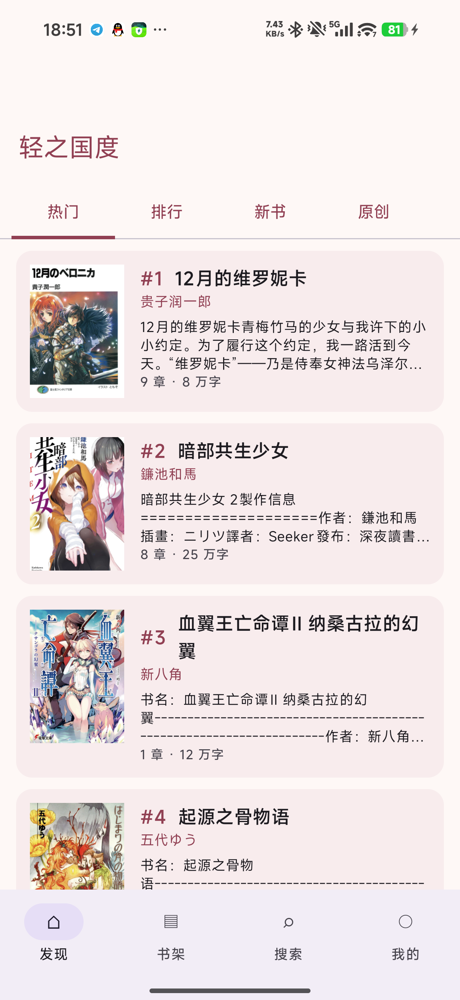
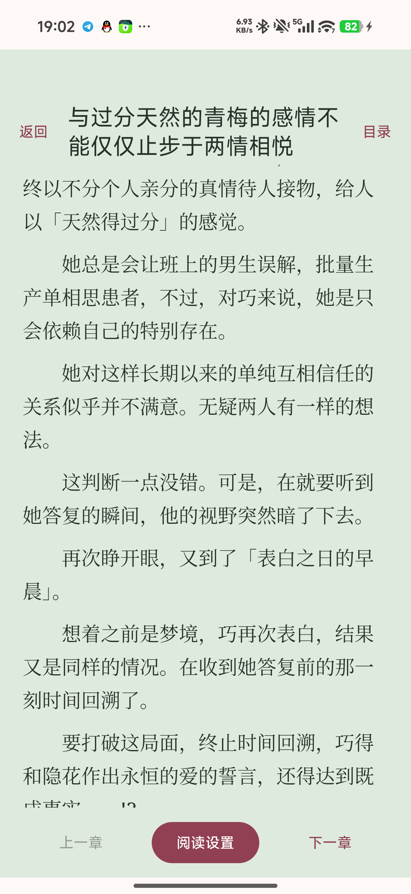

<p align="center">
  
</p>

# Mixn

Mixn 是面向个人账号的轻小说聚合阅读器，内置轻之国度（LK）与轻书架（LNS）两个来源。它把发现、搜索、书架、阅读进度和离线导出放在一个应用中，同时保持两站的登录态、接口协议和错误相互隔离。

当前稳定发布版本：**1.17.0**

- Android Release：[v1.17.0](https://github.com/HyperionHXH/lightnovel-android-aggregator/releases/tag/v1.17.0)
- Android APK：[Mixn-1.17.0.apk](https://github.com/HyperionHXH/lightnovel-android-aggregator/releases/download/v1.17.0/Mixn-1.17.0.apk)
- Windows 桌面端：随源码构建，仍属于预览版

> 本项目是非官方客户端，不隶属于轻之国度或轻书架。请遵守两个站点的服务条款和内容版权要求，不要批量抓取、分发或商业使用站点内容。

## 当前功能

### 发现与搜索

- 轻之国度和轻书架分别展示各自的热门、排行、新书和更新频道，不把两个站点强行混成一个榜单。
- 聚合搜索会并行查询两个来源，逐来源显示结果或错误；搜索不要求登录。
- 发现和搜索支持触底分页。官网固定榜单在站点没有更多数据时会明确提示，不会重复追加相同书籍。

### 书籍与阅读

- 书籍详情包含简介、标签、同书版本、分卷和章节目录。
- 统一书架按 `sourceId + remoteId` 区分来源，支持全部书籍、已下载书籍和阅读历史。
- 在线章节支持分页阅读和上下滚动，可调整字体、字号、行距、边距、背景、点击区域、图片缩放、屏幕方向、音量键翻页、屏幕常亮和进度条。
- 正文插图支持懒加载、协议相对地址和常见 CDN 地址；放大后长按可保存到相册，退出使用右上角关闭或系统返回。
- 付费章节按来源接口和账号权限处理。客户端不会绕过锁定、伪造余额或伪造阅读记录。

### 账号与站点功能

- 两个来源独立登录、退出和会话恢复，凭据不会跨站共享。
- 轻之国度：个人资料、轻币余额、七日签到、关注/粉丝、发布管理、消息中心和作品评论。
- 轻之国度评论支持最热/最新、分页、星级展示和发表评论；轻书架没有对应评论接口，因此不显示评论入口。
- 轻书架：个人资料、收藏同步和官方签到。
- 站点接口或账号权限不可用时，页面会保留来源、认证、超时、权限或内容不存在等具体错误。

### 下载与导出

- 可下载整本或指定分卷的可读章节，锁定章节不会被当作已下载内容。
- 下载页显示已完成卷数和章节数，并提供失败重试与删除记录。
- 已下载章节可导出为 UTF-8 TXT 或 EPUB 3；EPUB 会尽量包含封面和正文插图，TXT 使用 `[插图]` 占位。
- 导出优先写入设置中授权的下载目录；未选择目录时使用应用专用目录 `offline_library/exports`。应用不会扫描或导入本地 EPUB，也不会删除用户原始文件。
- “仅使用 Wi-Fi 下载”和后台更新提醒属于全局设置，后台提醒默认关闭。

### 字体与外观

- 提供系统字体和可下载字体的独立预览页，下载前后均可对比中文、标点和英文示例。
- 阅读设置与界面外观设置分开保存；各分组可单独恢复默认值。
- 主题、界面字号和图标大小可调整。轻书架章节若要求服务端专用字体，会优先使用该字体以避免正文乱码。

## 平台状态

### Android

Android 使用 Kotlin、Jetpack Compose、Material 3，最低支持 Android 8.0（API 26），目标 SDK 35。Android 是功能最完整、主要面向日常使用的客户端。

### Windows

桌面端位于 [`desktopApp`](desktopApp/)，使用 Kotlin/JVM 与 Swing，提供与 Android 相同的三项主导航：发现、书架、我的。当前已支持：

- 双源发现、搜索、详情、目录和正文阅读；
- 双源账号、会话恢复、书架和阅读历史；
- 阅读进度、离线章节保存和 EPUB 导出；
- 宽屏窗口、鼠标/键盘交互以及发现和搜索触底分页。

桌面端仍是预览版，评论、Android 通知/WorkManager、相册保存、音量键和部分移动端阅读设置暂未承诺与 Android 完全一致。详见 [`desktopApp/README.md`](desktopApp/README.md)。

## 截图

<p align="center">
  
  
  
</p>

## 构建与运行

### 环境要求

- JDK 17
- Android SDK 35（构建 Android 端）
- Windows 打包需要 JDK 17+ 的 `jpackage`
- 不需要全局 Gradle，仓库自带 Gradle Wrapper

### Android

在仓库根目录执行：

```powershell
./gradlew.bat :app:testDebugUnitTest :app:lintDebug :app:assembleDebug --no-daemon "-Pkotlin.incremental=false"
```

Debug APK：

```text
app/build/outputs/apk/debug/app-debug.apk
```

### Windows 桌面端

```powershell
./gradlew.bat :desktopApp:run
./gradlew.bat :desktopApp:installDist
./scripts/package-windows.ps1
```

`installDist` 输出到 `desktopApp/build/install/Mixn`；`package-windows.ps1` 会尝试生成 `desktopApp/build/windows/Mixn/Mixn` app-image。桌面端的详细说明、限制和接口边界见 [`desktopApp/README.md`](desktopApp/README.md)。

### Release 签名

Release APK 必须使用本地 Android Keystore 签名。首次配置可运行：

```powershell
./scripts/setup-release-signing.ps1
```

签名密钥、密码、`signing.properties` 和本地账号信息均不应提交到 Git。丢失同一签名密钥后，无法覆盖安装后续版本。

推送 `v*` 标签会触发 [Android Release 工作流](.github/workflows/release.yml)，执行测试、Lint、签名构建、`apksigner` 校验并上传 APK 与 SHA-256 文件。普通文档修改不需要单独创建 Release。

## 测试

默认测试使用固定响应，不访问真实账号或外网。完整本地回归命令：

```powershell
./gradlew.bat :app:testDebugUnitTest :app:lintDebug :app:assembleDebug :desktopApp:test --no-daemon "-Pkotlin.incremental=false"
```

轻书架匿名 SignalR 冒烟测试需要显式开启，网络不可用时保持跳过：

```powershell
$env:RUN_LNS_SMOKE = "true"
./gradlew.bat :app:testDebugUnitTest --tests "io.github.jiangyuyi.lightnovel.source.lightnovelshelf.LightNovelShelfLiveSmokeTest"
```

最近的 Android 真机/AVD 验证覆盖发现、双源搜索、登录态恢复、书架、详情/目录、分页与滚动阅读、正文图片、字体设置、缓存恢复、下载和 EPUB/TXT 导出。真实账号相关功能仍应由使用者自行确认，因为站点接口、登录态和付费权限会变化。

## 隐私、数据和已知限制

- 应用只请求完成对应功能所需的网络、通知和相册写入权限，不申请全盘存储权限。
- 密码、验证码和 `security_key` 不写入正文缓存、日志或崩溃报告；会话使用 Android Keystore 保护。退出登录会清理对应账号的私有缓存。
- 正文、封面和插图缓存只保留在当前设备，不会随 Git 或项目发布；导出文件由用户选择的目录保存。
- LK 的“浏览赚轻币”依赖官方客户端计时/心跳接口，当前没有可确认的公开合法接口，因此 Mixn 不伪造阅读时长，也不接入广告任务。
- 轻书架正文可能依赖站点下发的专用字体；字体或接口变化时会显示来源错误，而不是展示混淆文本。
- 网站接口、SignalR 协议、CDN 和榜单数据可能随时变化。来源适配器和错误处理集中在对应模块，遇到接口变更请优先提交可复现信息。
- 项目不包含本地 EPUB/TXT 导入或本地书库阅读功能；离线能力仅针对 Mixn 下载的在线章节及其导出。

## 工程结构

```text
app/src/main/java/io/github/jiangyuyi/lightnovel/
├─ core/       统一模型、来源契约、网络、缓存、会话、离线和阅读设置
├─ feature/    发现、搜索、书架、详情、阅读、账号、消息、字体和设置页面
└─ source/     轻之国度与轻书架的内置来源适配器
desktopApp/    Kotlin/JVM + Swing 桌面端和独立来源适配器
docs/          聚合方案、ADR、测试/交接记录和截图
```

## 贡献与反馈

请在 [GitHub Issues](https://github.com/HyperionHXH/lightnovel-android-aggregator/issues) 提交问题，附上：

- 平台、系统版本和 Mixn 版本；
- 来源（轻之国度/轻书架）、页面和复现步骤；
- 是否登录、是否使用缓存或离线模式；
- 脱敏后的错误文案、截图或测试响应。

不要在 Issue、日志或提交中粘贴密码、Token、`security_key`、签名密码或付费内容。

项目状态、架构决策和后续交接记录：

- [`CONTEXT.md`](CONTEXT.md)
- [`双源聚合开发大纲`](docs/AGGREGATOR_PLAN.md)
- [`来源适配器 ADR`](docs/adr/0001-built-in-source-adapters.md)
- [`AI 交接记录`](docs/AI_HANDOFF.md)
- [`CHANGELOG.md`](CHANGELOG.md)

## 许可证

客户端源代码使用 [MIT License](LICENSE)。站点内容、书籍正文、插图和轻之国度/轻书架相关商标不因本许可证改变其原有权利归属。
